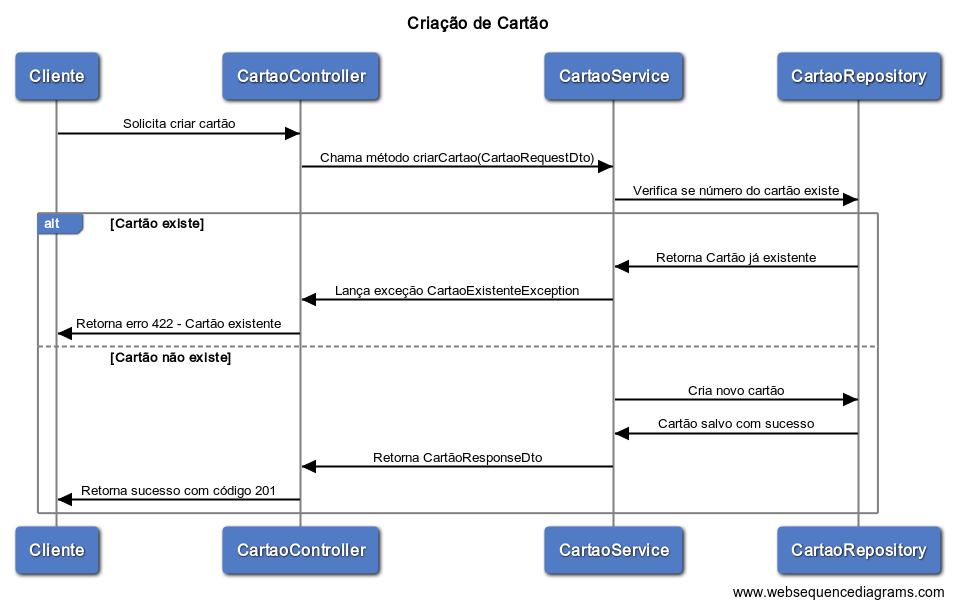
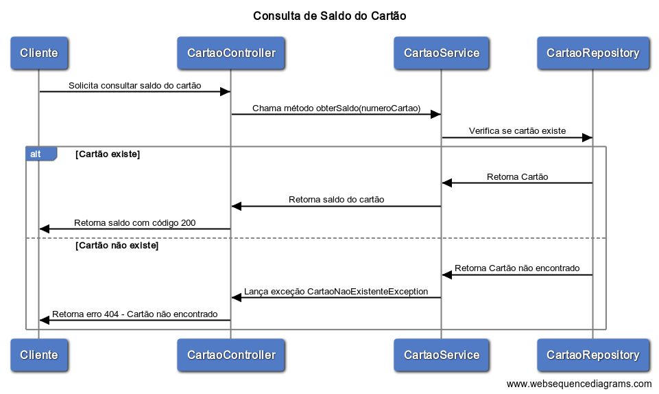
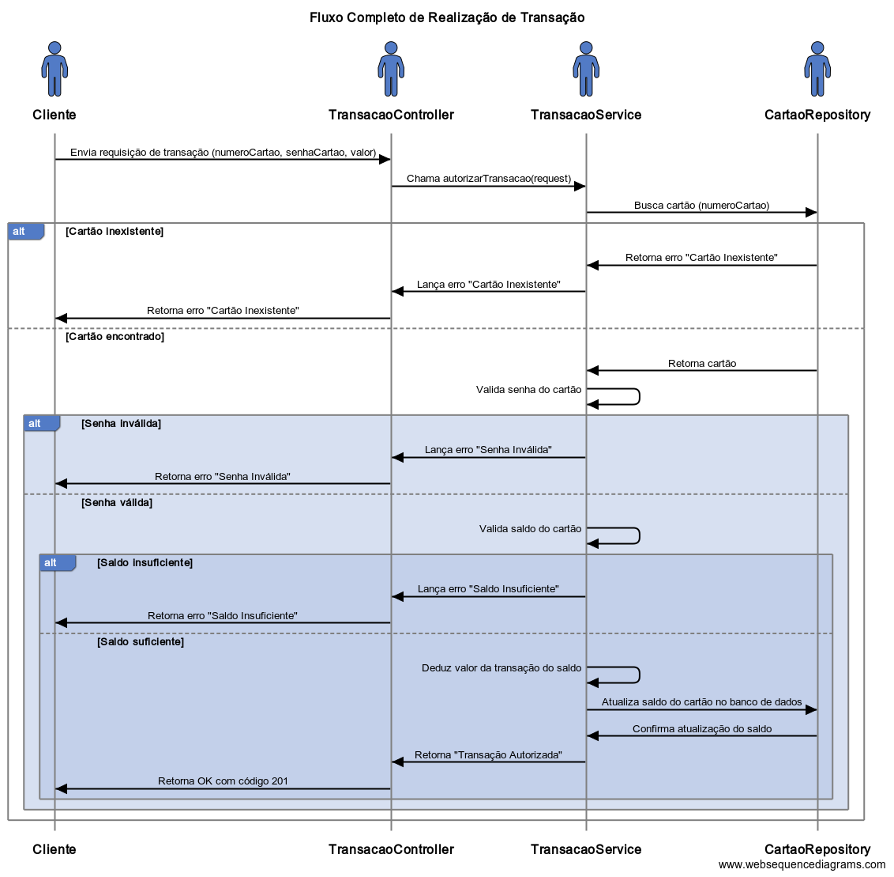

# Mini Autorizador VR
---

#### Lucas Teixeira Vieira

## **Descrição do Projeto**

O **Mini Autorizador VR** é uma aplicação Java desenvolvida como desafio técnico da VR utilizando framework Spring Boot para simular a autorização de transações com cartões. Este sistema foi projetado para garantir a segurança e consistência de transações financeiras, verificando regras de autorização, como existência de cartão, validação de senha e saldo disponível, além de garantir a integridade de uma transação financeira envolvendo concorrência.

A aplicação segue uma arquitetura simples modular, com separação entre camadas de **controlador**, **serviço**, **repositório** e **modelo** de dados. Além disso, ela utiliza autenticação básica e persistência de dados com JPA.

---

## **Funcionalidades**

1. **Gestão de Cartões**
    - Criação de novos cartões.
      
    - Consulta de saldo dos cartões existentes.
      
2. **Autorização de Transações**
    - Realiza uma transação financeira verificando:
        - Existência do cartão.
        - Validade da senha.
        - Saldo disponível.
    - Atualiza o saldo do cartão caso a transação seja autorizada.
      

---

## **Regras de Negócio**

1. **Criação de Cartão**
    - Um cartão só pode ser criado se o número não existir previamente.
    - Senha obrigatória.

2. **Autorização de Transação**
    - O cartão deve existir.
    - A senha fornecida deve ser válida.
    - O saldo do cartão deve ser suficiente para o valor solicitado.
    - Em caso de falha em qualquer regra, uma mensagem específica é retornada:
        - `CARTAO_INEXISTENTE`
        - `SENHA_INVALIDA`
        - `SALDO_INSUFICIENTE`

---

## **Tecnologias Utilizadas**

- **Linguagem:** Java 21
- **Frameworks:** Spring Boot, Spring Data JPA, Spring Security
- **Banco de Dados:** MySQL
- **Bibliotecas de Teste:** JUnit 5, Mockito
- **Ferramenta de Build:** Maven

---

## **Endpoints**

### **Cartões**
#### Criar um novo cartão
- **Method:** `POST`
- **URL:** `/cartoes`
- **Body:**
  ```json
  {
      "numeroCartao": "6549873025634501",
      "senha": "1234"
  }
  
#### Consultar saldo do cartão
- **Method:** `GET`
- **URL:** `/cartoes/{numeroCartao}`

### **Transações**
#### Realizar uma transação
- **Method:** `POST`
- **URL:** `/transacoes`
- **Body:**
  ```json
  {
    "numeroCartao": "6549873025634501",
    "senhaCartao": "1234",
    "valor": 10.00
  }

## Instalação

Para rodar o projeto localmente, siga as etapas abaixo:

### Passos para rodar

1. Clone o repositório:
    ```bash
    git clone https://github.com/lucasvieira34/mini-autorizador-vr
    cd miniautorizadorvr
    ```

2. Execute o **docker-compose.yml** fornecido (a aplicação utilizará o banco de dados MySQL).

3. Compile o projeto com Maven:
    ```bash
    mvn clean install
    ```

4. Execute a aplicação com o comando:
    ```bash
    mvn spring-boot:run
    ```

5. A aplicação estará rodando em `http://localhost:8080`.

OBS¹: Ao iniciar a aplicação, automáticamente será inserido na base de dados na tabela de usuários, um usuário default conforme pre-requisitado, com o com login = **username** e senha = **password**.

OBS²: A aplicação está configurada para **dropar e recriar** a base de dados a cada inicialização.

OBS³: No diretório **src/resources** você poderá encontrar um arquivo **swagger.yaml** contendo a definição OpenAPI da API.